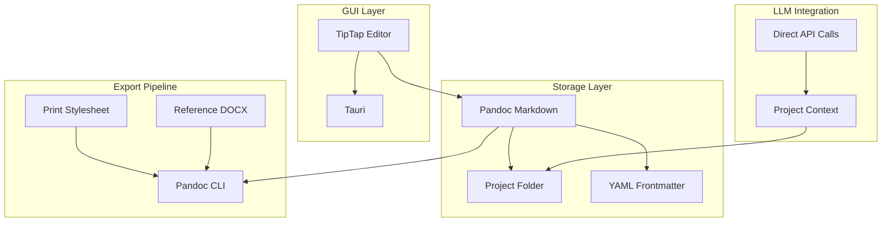

# High-Level Architecture

This document describes the Phase 0 architecture. Future phases (RAG, brand manifest, clause library, server-hosted deployment) are noted where they extend or replace Phase 0 components.

---

## Phase 0 Architecture Overview

---

## GUI Layer

**Responsibility.** Rich Markdown editing with semantic block support. The user authors in a Word-like interface; the output is valid Pandoc Markdown.

**Technology.** TipTap (ProseMirror-based). Custom node types map to Pandoc semantic constructs: fenced divs (`:::callout`, `:::executive-summary`), headings, lists, tables, footnotes. The editor serialises to Pandoc-extended Markdown. See [ADR-0004](adrs/ADR-0004-tiptap-editor-framework.md).

**Deployment.** Wrapped in Tauri for desktop. Local application; no server required. Documents are files on disk in the project folder. See [ADR-0003](adrs/ADR-0003-tauri-desktop-framework.md).

**Does not (Phase 0).** Real-time collaboration, cloud sync, web-based deployment, branch/merge UI. Those are Phase 1+.

---

## Storage Layer

**Responsibility.** Persist documents as Pandoc Markdown with YAML frontmatter. Organise work within a project context.

**Format.** Plain-text Pandoc Markdown. YAML frontmatter for document metadata (title, author, date, custom fields). Human-readable, diff-able, version-control friendly.

**Project folder schema.** Each project has a standard layout (optionally overridable via `docforge.yaml` in Phase 0):

| Folder | Purpose |
|--------|---------|
| `inputs/` | Source material — transcripts, research, raw notes |
| `working/` | Drafts in progress, rough notes |
| `context/` | Brief, constraints, project parameters |
| `deliverables/` | Final documents ready for export |

DocForge-specific format documentation (frontmatter schema, conventions) is a Phase 0 deliverable. The LLM receives selected files from these folders as context when assisting. Full RAG (retrieval over the entire project) is Phase 1; Phase 0 passes context explicitly.

**Does not (Phase 0).** Database, object storage, DMS integration. Files on disk only.

---

## Export Pipeline

**Responsibility.** Produce PDF and DOCX from Markdown without manual post-processing.

**Technology.** Pandoc CLI. A print stylesheet (CSS) controls PDF appearance. An optional reference DOCX template provides DOCX styling. Filters such as pandoc-crossref for captions and cross-references.

**Flow.** Markdown file → Pandoc (with CSS and/or reference DOCX) → PDF or DOCX. Deterministic and reproducible. The author owns the stylesheet and template; output quality is under their control.

**Does not (Phase 0).** PPTX export (Phase 1+). Custom renderer; Pandoc is the engine.

---

## LLM Integration (Phase 0)

**Responsibility.** Provide AI assistance for drafting. The LLM receives document content and selected project context.

**Model.** Direct API calls. No RAG. On each request, the client sends: current document content, brief (from context/), and optionally files from inputs/ or working/. The LLM responds with suggested content or edits.

**Provider.** Pluggable (provider, region, model as config). Australian-region endpoints for data sovereignty when needed. Phase 0 assumes API-based models; local/private models are Phase 2+.

**Does not (Phase 0).** RAG over project folder, clause recommendation, assembly engine. Those are Phase 1+.

---

## Future Layers (Phase 1+)

| Component | Phase 0 | Phase 1+ |
|-----------|---------|----------|
| RAG over project | No | Yes |
| Brand manifest | Print CSS + reference DOCX | Full versioned manifest |
| Clause library | No | Yes |
| Server-hosted | No (local-only) | Yes |
| Collaboration | No | Branch/merge, sharing |
| DMS integration | No | iManage, NetDocuments, Content Manager |

---

## Key Technology Decisions (Reference)

- **Backing format:** Pandoc Markdown — human-readable, diff-able, LLM-consumable; see [principles](principles.md#1-document-is-data)
- **Deployment (Phase 0):** Local-first; server-hosted Phase 1+; see [principles](principles.md#6-portable-format-deployment-model-evolves-with-phase)
- **Desktop framework:** Tauri — [ADR-0003](adrs/ADR-0003-tauri-desktop-framework.md)
- **Editor framework:** TipTap (ProseMirror) — [ADR-0004](adrs/ADR-0004-tiptap-editor-framework.md)

---

## Open Questions

### Pending ADR acceptance

- **[ADR-0001](adrs/ADR-0001-llm-provider-pluggability.md)** (proposed) — LLM provider pluggability; recommends provider/region/model as config, Azure Australia East for government. Must be accepted before any government pilot. See [RAIDD I-002](../../governance/raid.md).
- **[ADR-0002](adrs/ADR-0002-docx-export-library-selection.md)** (proposed) — Export library selection; recommends Pandoc-only for Phase 0 PDF and DOCX. Unblocks export pipeline implementation. See [RAIDD I-005, D-002](../../governance/raid.md).

### Specification gaps

- **Format documentation** — DocForge-specific conventions (frontmatter schema, project folder layout) are a Phase 0 deliverable per [principles](principles.md#format-documentation-and-project-conventions). The exact frontmatter schema and `docforge.yaml` format need specification before implementation.

---

*Previous: [Architectural Principles](principles.md) · Next: [ADRs](adrs/) · See also: [FRS](frs.md), [NFRs](nfrs.md)*
